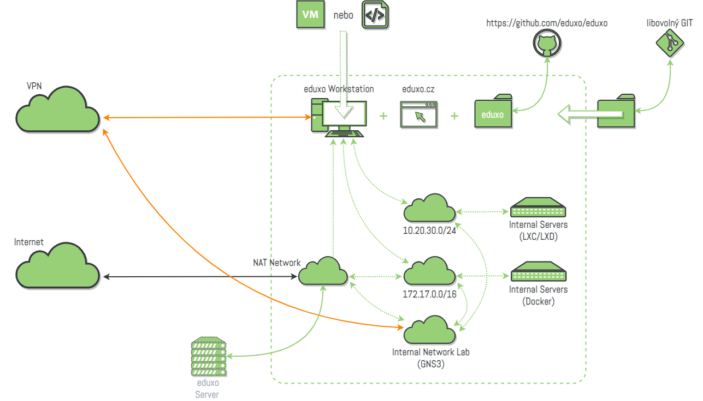

# eduxo Workstation (cz)

**Přenositelné virtuální prostředí, ve kterém je možné vytvářet, spouštět a sdílet různé úlohy a cvičení.**

<figure><figcaption></figcaption></figure>

## Proč používáme distribuci Ubuntu Server? <a href="#h.ju70cljn0pw_l" id="h.ju70cljn0pw_l"></a>

Existuje několik důvodů, proč je Ubuntu Server dobrou volbou. Jedním z nich je, že se jedná o stabilní a spolehlivou platformu.

Použití operačního systému Ubuntu má několik výhod. Mezi ně patří:

1. Nabízí stabilní a spolehlivou platformu.
2. Má velkou a aktivní komunitu uživatelů a vývojářů, kteří přispívají k vývoji a zdokonalování operačního systému.
3. Je všestranný a lze jej používat na široké škále hardwarových platforem, takže je dobrou volbou pro uživatele s různými počítačovými potřebami.
4. Nabízí širokou škálu nástrojů a funkcí, které usnadňují nastavení a správu serveru, včetně podpory různých serverových aplikací a služeb.
5. Jedná se o neustále se vyvíjející a zdokonalující se platformu, pro kterou jsou pravidelně vydávány aktualizace a nové verze.

## Kompatibilita <a href="#h.58z8kqpqdktj_l" id="h.58z8kqpqdktj_l"></a>

* toto prostředí není závislé na žádné specifické platformě, celou VM lze spustit pod libovolným OS v programu VirtualBox,
* cvičení a úlohy jsou kompatibilní s VM eduxo Workstation,
* cvičení a úlohy kompatibilní s prostředím Cylab jsou příslušně označeny (pozor, některé typy laboratorních cvičení mohou být na prostředí Cylab přímo závislé).

## K čemu mohu/nemohu používat eduxo Workstation?&#x20;

#### Toto prostředí lze použít k výuce praktických cvičení v oblastech:

* administrace pracovní stanice Linux,
* administrace serveru Linux,
* zabezpečení systémů Linux,
* správa síťových služeb Linux,
* úvod do počítačových sítí,
* switching (přepínání) a routing (směrování),
* bezpečnost v počítačových sítí,
* správa a dohled nad počítačovou sítí,
* diagnostika počítačové sítě,
* návrh počítačové sítě,
* kryptografie,
* bezpečnost sítí a služeb,
* správa a dohled nad počítačovou sítí,
* detekce a prevence síťových útoků,
* testování bezpečnosti.

#### **Toto prostředí NElze využít k výuce praktických cvičení z oblastí:** <a href="#h.ph2r71cwamhc_l" id="h.ph2r71cwamhc_l"></a>

* administrace pracovní stanice Windows,
* administrace serveru Windows,
* zabezpečení systémů Windows,
* správa síťových služeb Windows.

## Jak získat eduxo Workstation?

### 1. Stáhnout VM

**Download link:** https://drive.google.com/drive/folders/1A\_opDISoGS34Qv2K3pXFpJlER598i9vg?usp=sharing

#### Základní informace o VM

**OS:** Ubuntu Server 22.04\
**Login:** sysadmin:Netlab!23\
**Hostname:** eduxo\
**FQDN:** eduxo.lab

#### Požadavky

```
+---------------------- MINIMUM ----------------------+
|    Host System:           64-bit x86 System         |
|    Memory:                4 GB RAM                  |
|    Number of Processors:  2                         |
|    Free Disk Space:       60 GB Hard Disk           |
+-----------------------------------------------------+

+-------------------- RECOMMENDED --------------------+
|    Host System:           64-bit x86 System         |
|    Memory:                16 GB RAM                 |
|    Number of Processors:  4                         |
|    Free Disk Space:       80 GB Hard Disk           |
+-----------------------------------------------------+
```

#### Topologie vnitřních sítí

```
+----------------+
|    INTERNET    |
+----------------+
        |
        +----------------------------------------+
        |-----------+                            |
    +-->|   ens32   |-----> DHCP                 |
    |   |-----------+                            |
    |   |                                        |
    [NAT]                                        |
    |   |                                        |                               
    |   |-----------+                            |
    +-->|  virtbr0  |-----> 192.168.122.1/24     |
    |   |-----------+                            |
    |   |                                        |                                  
    |   |-----------+                            |
    +-->|  docker0  |-----> 172.17.0.1/16        |
    |   |-----------+                            |
    |   |                                        |                                  
    |   |-----------+                            |
    +-->|  lxdbr0   |-----> 10.20.30.1/24        |
        |-----------+                            |
        +----------------------------------------+
```

### 2. Spuštěním skritpu `init-VM.sh`&#x20;

1. Nainstalujte operační systém Linux Ubuntu (doporučujeme Ubuntu Server 22.04),&#x20;
2. Stáhněte si skript `init-VM.sh`,&#x20;
3. Spusťte skript,&#x20;
4. Pohodlně se usaďte s šálkem dobré kávy a počkejte, až se dokončí instalace všech nástrojů.
